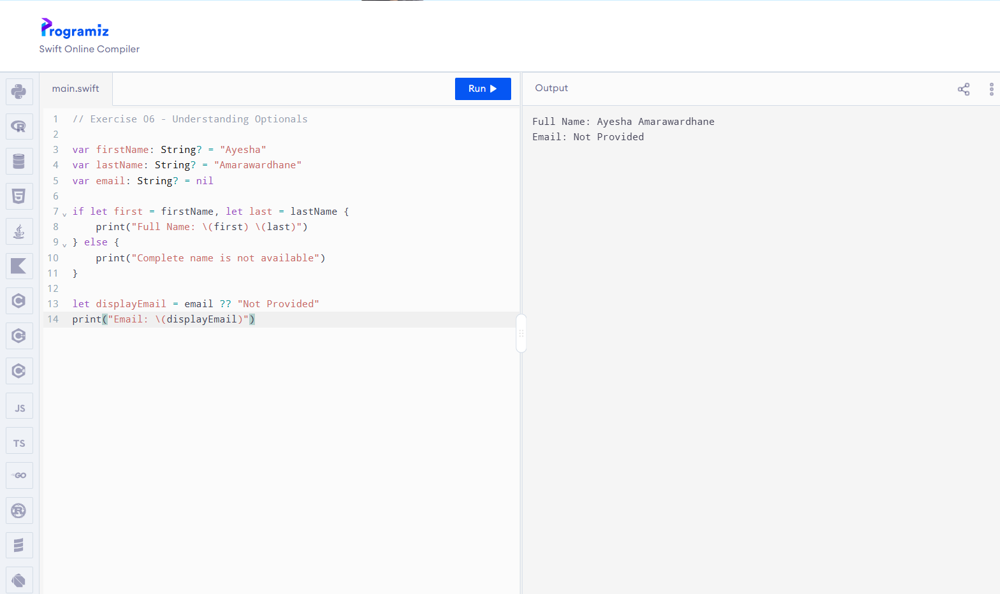
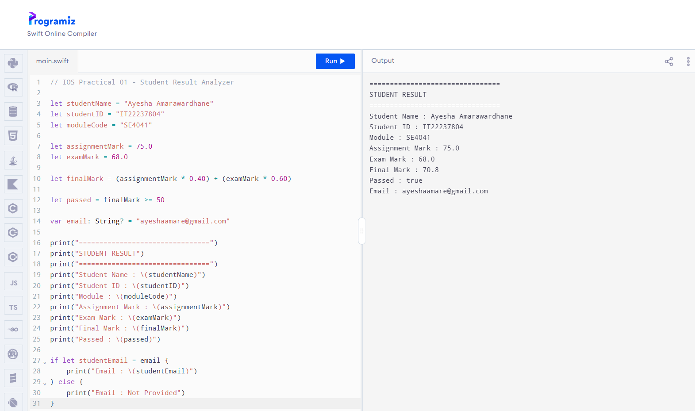
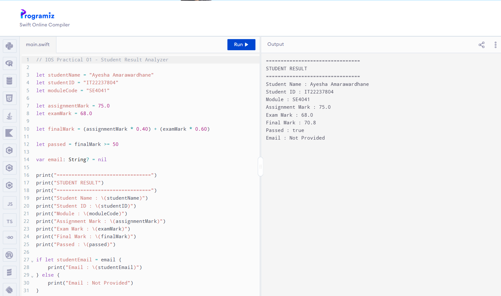

# SE4041 Practical 01

**Student Name:** Amarawardhane A S
**Student ID:** IT22237804  
**Module:** SE4041 – Mobile Application Design and Development  
**Environment Used:** Programiz Swift Online Compiler  

## Completed Files

- Exercise01.swift
- Exercise02.swift
- Exercise03.swift
- Exercise04.swift
- Exercise05.swift
- Exercise06.swift
- FinalChallenge.swift

## Final Practical Task

Student Result Analyzer

The program:
- Stores student information
- Calculates the final mark using 40% assignment and 60% exam marks
- Determines pass status
- Uses an optional email address
- Safely handles missing email values

## Practical Evidence

### Guided Exercise Output

### Final Challenge - With Email

### Final Challenge - No Email

